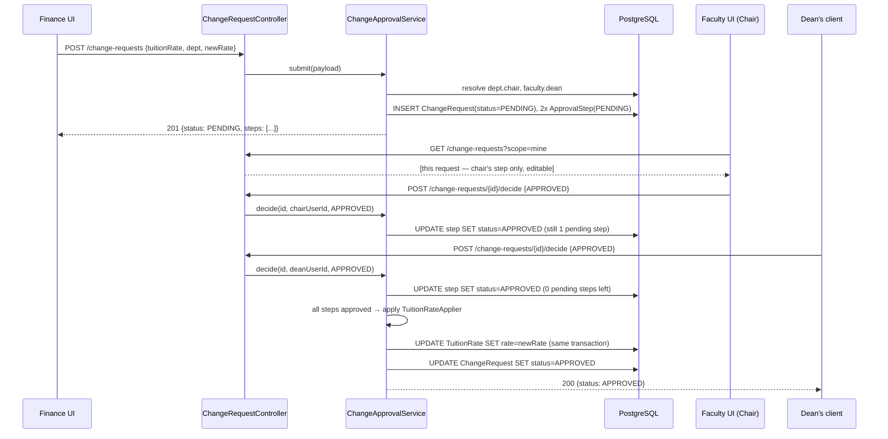

# UniFlow — Java Backend Architecture

**Status:** Implementation-ready companion to `UniFlow_Implementation_Plan_v1.0.docx` (§3–6) and
`UniFlow_University_Digital_Campus_Software_Specification.docx` (§29).
**Scope:** A concrete Spring Boot design for the domains that are actually built and working in the
current UI prototype (`src/`) — not a restatement of the full product spec. Where this document is
silent on a domain (Admissions, Examinations, AI, Mobile), the Implementation Plan's generic
architecture is still the authority; nothing here contradicts it.

The prototype today is a Vite + React + TypeScript app with **zero backend** — every entity in this
document currently lives as a `useState` value inside `UniFlowProvider` (`src/state.tsx`), seeded from
literal arrays in `src/data.ts`, and reset on every full page reload. This document specifies the
Spring Boot service that would replace that in-memory store, keeping the exact same domain shapes and
behaviors the prototype already validated.

---

## 1. Why this document exists

The Implementation Plan describes an aspirational, full-scope SIS (Admissions, Examinations,
multi-campus tenancy, AI advisors, mobile apps). The prototype validated a much narrower, but very
concrete, slice of that: course catalog + programs with per-program Core/General classification,
course-content authoring with a two-tier permission model, a generic multi-person change-approval
engine, and a Finance role with tuition/fee/clearance management. This document is the data model and
API contract for *that* slice, written so a backend team could start implementing against it directly.

Package root used throughout: `edu.uniflow`.

---

## 2. Module boundaries

Following the Plan's "modular monolith first" principle (§4.1), one deployable, packages split by
bounded context:

```
edu.uniflow
├── identity        // users, roles, sessions
├── academiccore     // faculties, departments, programs, courses, occurrences
├── coursecontent    // modules, topics, resources, coordinator/contributor permissions
├── assignments      // course assignments
├── finance          // tuition rates, fees, clearance schedule, student accounts, ledger
├── approvals        // generic multi-person Change Request workflow (used by finance today,
│                     // designed to be reusable by any future domain)
├── comms            // announcements
├── registration     // course selection, section choices, schedule-conflict detection
└── common           // shared value objects, audit, API error model
```

Each package is a Spring `@Configuration`-scanned module with its own `controller` / `service` /
`repository` / `domain` sub-packages. No package reaches into another's `repository` layer directly —
cross-context reads go through the other module's `service` interface, matching the Plan's "no
cross-context joins in application code" rule (§6.1).

---

## 3. Domain model

Each entity below is named identically to its TypeScript source (`src/data.ts` / `src/state.tsx`) so
the mapping is traceable line-for-line. `id` fields are `UUID` unless the prototype uses a natural key
(course/department/program codes), in which case the natural key remains the primary key — the
prototype leans on human-readable codes as identifiers throughout, and changing that would break the
mental model every screen was built around.

### 3.1 `identity`

```java
@Entity
class User {
    @Id UUID id;
    String name;
    String email;
    @Enumerated(EnumType.STRING) Role primaryRole;   // STUDENT | FACULTY | ADMIN | FINANCE
    // Faculty-specific and student-specific profile fields live in separate
    // one-to-one tables (StudentProfile, FacultyProfile) rather than a wide User row.
}

enum Role { STUDENT, FACULTY, ADMIN, FINANCE }
```

The prototype's role model (`src/types.ts`, `Role`) is a single active role per session with an
in-app switcher (`RoleMenu` in `src/shell.tsx`) — a demo convenience. In production, `User.primaryRole`
gates default landing/navigation, but authorization (§6) is always evaluated from the authenticated
principal's actual granted roles/scopes, never a client-supplied "current role."

### 3.2 `academiccore`

Mirrors `src/data.ts` (`initialFacultyStructure`, `initialFacultyMembers`, `catalogCourses`,
`initialPrograms`) and the `Course` type used for a student/faculty's own section list.

```java
@Entity class Faculty {              // FacultyDivision in TS
    @Id String name;                 // e.g. "Faculty of Science"
    String dean;                     // FK to FacultyMember.name in the prototype; see §3.2.1
    @OneToMany List<Department> departments;
}

@Entity class Department {
    @Id String name;                 // e.g. "Department of Computing"
    @ManyToOne Faculty faculty;
    String chair;
}

@Entity class FacultyMember {
    @Id UUID id;
    String name;
    @ManyToOne Department department;
    String load;                     // "4 courses" — display string in the prototype; keep as
                                      // a computed projection (COUNT of CourseOccurrence.instructor)
                                      // in the real system rather than a stored, driftable field.
    String email;
}

@Entity class CatalogCourse {        // catalogCourses[] in TS — the department catalog record
    @Id String code;                 // "COMP3101"
    String name;
    @ManyToOne Department department;
    int credits;
    String level;                    // "Level 1".."Level 4"
    @ElementCollection List<String> prerequisiteCodes;   // course codes; see §3.2.2 on why this
                                                          // stays a code list, not an FK collection
    String meetPattern;               // derived display string, e.g. "Mon/Wed · 10:00–11:30"
    boolean openForRegistration;      // `ok` in TS
    @OneToMany(cascade = ALL, orphanRemoval = true)
    List<CourseOccurrence> occurrences;
}

@Entity class CourseOccurrence {
    @Id UUID id;
    @ManyToOne CatalogCourse course;
    String type;                     // "Lecture" | "Tutorial" | "Lab"
    String day;
    String time;
    String room;
    @ManyToOne FacultyMember instructor;
    int capacity;
    String sectionGroup;              // nullable — ties a Lab to the Tutorial it rides with; see §3.2.3
}

@Entity class CourseSection {        // Course in TS — a specific offering a person is enrolled/teaching in
    @Id UUID id;
    String code;                     // "COMP2140" — references CatalogCourse.code
    String name;
    String sectionLabel;             // "Section 01"
    @ManyToOne FacultyMember instructor;
    String coordinator;              // name of the Course Coordinator — see §5
    @ElementCollection List<String> teachers;   // names of everyone allowed to add resources
    String semester;
    int credits;
    String room;
    String schedule;
    @Enumerated(EnumType.STRING) SectionStatus status;   // IN_PROGRESS | COMPLETED | UPCOMING
}

@Entity class Program {
    @Id String id;                   // "bsc-cs"
    String name;
    @ManyToOne Faculty faculty;
    String creditsLabel;
    String studentsLabel;
    @OneToMany(cascade = ALL, orphanRemoval = true)
    List<ProgramRequirement> requirements;
}

@Entity class ProgramRequirement {
    @Id UUID id;
    @ManyToOne Program program;
    String name;                     // "Core Computer Science", "Electives", ...
    int credits;
    @OneToMany(cascade = ALL, orphanRemoval = true)
    List<RequirementCourse> courses;
}

@Entity class RequirementCourse {    // the whole reason this document exists — see §29.3 of the spec
    @Id UUID id;
    @ManyToOne ProgramRequirement requirement;
    String courseCode;
    @Enumerated(EnumType.STRING) RequirementType type;   // CORE | GENERAL
}

enum RequirementType { CORE, GENERAL }
```

#### 3.2.1 Chair/dean as names, not just FKs

The prototype resolves a change request's required approvers by walking `facultyStructure` from a
department up to its faculty (`resolveTuitionApprovers` in `screens-admin.tsx`): a department's
`chair` and its faculty's `dean` are looked up by **name string**, not by a stored `FacultyMember` id.
That's fine for a 12-person demo cast; in production, `Department.chair` and `Faculty.dean` should be
`@ManyToOne FacultyMember` references, not strings, precisely so the approvals engine (§5.2) can
resolve a required approver to a real user id instead of a name it hopes is unique.

#### 3.2.2 Why `RequirementCourse` and `CatalogCourse.prerequisiteCodes` don't do the "correct" FK

**This is the core modeling decision the prototype surfaced** (see spec §29.3): whether a course is
Core or General is *not* a property of the course — the exact same course code can be Core for one
program and General for another (`COMP3101` is Core for `bsc-cs`, General for `bsc-math`). That's why
`RequirementCourse` belongs to `ProgramRequirement`, not to `CatalogCourse` — the type is a fact about
the *program's* curriculum, never the course. Prerequisites, by contrast, genuinely are a property of
the course itself, which is why `CatalogCourse.prerequisiteCodes` stays there as a simple code list
rather than needing a join table — a prerequisite doesn't vary by which program is looking at it.

#### 3.2.3 `sectionGroup` and the Lecture-before-Tutorial-before-Lab ordering rule

A course can offer more than one section of a given occurrence type — e.g. two alternate Lecture times,
or two Tutorial groups each paired with its own Lab (`COMP3105` in the prototype: two Lectures, two
Tutorial+Lab pairs). Two rules the prototype enforces that a real backend must re-enforce server-side,
not just in the registration UI:

1. **Lab bundling.** When a `Lab` occurrence's `sectionGroup` matches a `Tutorial` occurrence's
   `sectionGroup` on the same course, the Lab is not independently selectable — choosing that Tutorial
   implicitly selects its Lab (`bundledSessions` / `isBundledLab` in `screens-student-records.tsx`).
   `CourseOccurrenceService.selectableOccurrences(course)` should filter out any `Lab` whose
   `sectionGroup` is claimed by a `Tutorial`, exactly mirroring the frontend's `occurrenceGroups()`.
2. **Weekly ordering.** Whenever a course has 2+ sections of an earlier type (Lecture, then Tutorial,
   then Lab — Tutorial and Lab both optional), every section of the earlier type must have *started* by
   the time every section of the next type starts that week — a student may end up in any combination.
   The one exception: if the earlier type runs late in the week (Thursday/Friday) and the next type
   starts early (Monday–Wednesday), that reads as the normal following week's cycle (e.g. a Tue/Thu
   lecture reviewed by a Monday tutorial), not a same-week violation. `occurrenceOrderIssue()` in
   `src/data.ts` is the reference implementation — port it as `CourseOccurrenceValidator` and run it in
   `POST/PATCH .../occurrences`, returning 422 with the same message the admin UI already shows, rather
   than re-deriving the rule independently on the backend.

### 3.3 `coursecontent`

Maps `CourseModuleItem` / `CourseTopic` / `CourseResource` (`src/data.ts`) and the mutation actions
`addModule` / `addTopic` / `addResource` (`src/state.tsx`).

```java
@Entity class CourseModule {
    @Id UUID id;
    @ManyToOne CourseSection course;
    String label;                    // "Module 3" — display ordinal, kept as a stored field so
                                      // reordering doesn't require renumbering every row
    String title;
    @Enumerated(EnumType.STRING) ModuleStatus status;   // PUBLISHED | DRAFT
    @Lob String intro;
    @OneToMany(cascade = ALL, orphanRemoval = true)
    List<CourseTopic> topics;
}

@Entity class CourseTopic {
    @Id UUID id;
    @ManyToOne CourseModule module;
    String title;
    String summary;
    @OneToMany(cascade = ALL, orphanRemoval = true)
    List<CourseResource> resources;
}

@Entity class CourseResource {
    @Id UUID id;
    @ManyToOne CourseTopic topic;
    String title;
    @Enumerated(EnumType.STRING) ResourceKind kind;  // LECTURE_NOTES | SLIDES | READING | VIDEO
                                                       // | QUIZ | ASSIGNMENT | LINK
    String meta;
    @ManyToOne FacultyMember addedBy;
    @Lob String intro;                // nullable — quiz/assignment resources don't carry one
    @ElementCollection List<String> outline;
    String externalRoute;             // `to` in TS — an override route for Quiz/Assignment kinds
                                       // that link straight into the assignments/quizzes module
                                       // instead of a generic resource-detail page
}
```

Permission model — enforced in `CourseContentService`, not in the entity layer:

- **Structure edits** (`addModule`, `addTopic`) require `principal.name == course.coordinator`.
- **Resource edits** (`addResource`) require `principal.name == course.coordinator
  || course.teachers.contains(principal.name)`.
- Students only ever see modules with `status = PUBLISHED`; the query the student-facing endpoint runs
  filters `status` server-side — the prototype does this client-side (`.filter(m => m.status ===
  "Published")` in `CourseContent`), which is exactly the kind of check that must move server-side, since
  a client-side filter is not a security boundary.

### 3.4 `assignments`

```java
@Entity class CourseAssignment {
    @Id String id;                    // "a1", "a2", "a3" in the prototype — switch to UUID once
                                       // assignments become genuinely per-course (see §7.3)
    @ManyToOne CourseSection course;
    String title;
    LocalDate dueDate;                 // prototype stores "Feb 12" + "11:59 PM" as two free-text
    String dueTime;                    // strings entered via the faculty edit form; split here so
                                        // due-date logic (sorting, "due tomorrow" banners) is real
    int points;
    @Lob String intro;
    @ElementCollection List<String> tasks;
    @Lob String feedback;
    @OneToMany(cascade = ALL, orphanRemoval = true)
    List<RubricLine> rubric;           // { criterion, points }
}

@Entity class Submission {
    @Id UUID id;
    @ManyToOne CourseAssignment assignment;
    @ManyToOne User student;
    Instant submittedAt;
    @Enumerated(EnumType.STRING) SubmissionStatus status;   // NOT_SUBMITTED | SUBMITTED | GRADED | MISSING
    Integer score;
}
```

`Submission` doesn't exist as a real entity in the prototype yet — `submittedCount` / `gradedCount` are
static display strings on `CourseAssignment`. It's included here because it's the obvious next real
table once submissions become interactive; §7.3 covers the gap explicitly rather than pretending it's
already solved.

### 3.5 `finance`

Maps `initialTuitionRates`, `FeeItem`, `ClearanceMilestone`, `studentAccounts`,
`transactionsByStudent`, `financialAidPrograms` (`src/data.ts`).

```java
@Entity class TuitionRate {
    @Id @ManyToOne Department department;
    BigDecimal ratePerCredit;
}

@Entity class Fee {
    @Id UUID id;
    String name;
    BigDecimal amount;
    @Enumerated(EnumType.STRING) FeeType type;   // MANDATORY | MISCELLANEOUS
    String description;
}

@Entity class ClearanceMilestone {
    @Id UUID id;
    String label;
    int percent;
    LocalDate dueDate;
}

@Entity class StudentAccount {
    @Id @ManyToOne User student;
    BigDecimal balance;
    LocalDate dueDate;
    @Enumerated(EnumType.STRING) AccountStatus status;   // CURRENT | OVERDUE | PAID
    boolean hold;
    String holdReason;
}

@Entity class Transaction {
    @Id UUID id;
    @ManyToOne StudentAccount account;
    LocalDate date;
    String description;
    BigDecimal amount;                 // positive = charge, negative = credit/payment — matches
                                        // the sign convention already used in transactionsByStudent
    @Enumerated(EnumType.STRING) TransactionStatus status;
}

@Entity class FinancialAidProgram {
    @Id String id;                     // "deans-award"
    String name;
    @Enumerated(EnumType.STRING) AidType type;   // SCHOLARSHIP | GRANT
    BigDecimal totalAwarded;
    @Enumerated(EnumType.STRING) AidStatus status;   // OPEN | CLOSED
    String sponsor;
    String criteria;
    @OneToMany(cascade = ALL, orphanRemoval = true)
    List<Disbursement> disbursements;
}
```

None of `TuitionRate`, `Fee`, or `ClearanceMilestone` are ever written to directly by a controller —
every mutation to them goes through the approvals engine (§5). The service layer should not expose a
plain `PUT /tuition-rates/{dept}`; the only way a rate changes is a `ChangeRequest` reaching
`APPROVED`.

### 3.6 `approvals`

Maps `ChangeRequest` / `ApprovalStep` / `ChangeRequestPayload` (`src/state.tsx`). This is the one
place the prototype invented a genuinely generic mechanism, and it's worth preserving that generality
in Java rather than special-casing it per payload type in the controller layer.

```java
@Entity class ChangeRequest {
    @Id UUID id;
    String title;
    String summary;
    @ManyToOne User initiatedBy;
    Instant initiatedAt;
    @Enumerated(EnumType.STRING) RequestStatus status;   // PENDING | APPROVED | REJECTED
    @OneToMany(cascade = ALL, orphanRemoval = true)
    List<ApprovalStep> steps;

    @Enumerated(EnumType.STRING) PayloadType payloadType;   // TUITION_RATE | FEE | MILESTONE_UPDATE
                                                             // | MILESTONE_ADD
    @Type(JsonType.class) @Column(columnDefinition = "jsonb")
    JsonNode payload;                  // the TS discriminated union, stored as JSONB rather than
                                        // four nullable columns or four join tables
}

@Entity class ApprovalStep {
    @Id UUID id;
    @ManyToOne ChangeRequest request;
    String role;                       // "Department Chair", "Faculty Dean", "VP of Finance"
    @ManyToOne User approver;
    @Enumerated(EnumType.STRING) StepStatus status;   // PENDING | APPROVED | REJECTED
    Instant decidedAt;
}
```

**Payload as JSONB, not four payload tables.** The prototype's `ChangeRequestPayload` is a TypeScript
discriminated union (`kind: "tuitionRate" | "fee" | "milestoneUpdate" | "milestoneAdd"`). Modeling
that as four separate join tables (`TuitionRatePayload`, `FeePayload`, ...) would force every reader of
`ChangeRequest` to `LEFT JOIN` four tables it mostly doesn't need. JSONB plus a `payloadType`
discriminator keeps the request row self-contained and makes adding a fifth payload kind later a
one-enum-value change, not a migration. The trade-off — no FK integrity on the JSON's embedded
references (e.g. `department` inside a `tuitionRate` payload) — is acceptable because the payload is
only ever read by the applier that already knows its shape (below), never queried across requests.

**Applying an approved request** — the prototype's `applyPayload` (`state.tsx`) is a plain
if/else-if chain executed the moment the last required step approves. In Java, express the same thing
as a strategy per payload type so adding a fifth kind doesn't mean editing a growing switch statement
buried in the workflow engine:

```java
interface ChangeApplier<T> {
    PayloadType handles();
    void apply(T payload);
}

@Component class TuitionRateApplier implements ChangeApplier<TuitionRatePayload> { ... }
@Component class FeeApplier implements ChangeApplier<FeePayload> { ... }
// ChangeApprovalService holds Map<PayloadType, ChangeApplier<?>>, deserializes the JSONB payload
// against the matching type, and invokes .apply() once the request transitions to APPROVED.
```

**Decision logic** (`ChangeApprovalService.decide(requestId, approverId, decision)`), matching
`decideStep` in `state.tsx` exactly:

1. Load the request; find the step where `step.approver == approverId && step.status == PENDING`.
   If none exists, reject the call (403) — this is what stops one approver from deciding someone
   else's step.
2. Set that step's status and `decidedAt`.
3. If `decision == REJECTED`: set `request.status = REJECTED`. Done — a single rejection is final,
   there's no "some approved, some rejected" partial state.
4. Else if every step is now `APPROVED`: set `request.status = APPROVED` and invoke the matching
   `ChangeApplier` inside the **same transaction** — the prototype's in-memory version effectively
   gets this atomicity for free; the real system must not let a request end up `APPROVED` with its
   payload unapplied because of a later failure.
5. Else: `request.status` stays `PENDING`.

This whole flow should run inside a single `@Transactional` service method with a pessimistic lock (or
optimistic version check) on the `ChangeRequest` row — two approvers deciding their steps at the same
instant is exactly the race this workflow exists to get right.

### 3.7 `comms`

```java
@Entity class Announcement {
    @Id UUID id;
    String title;
    String source;
    LocalDate date;
    // "unread" is not a column on Announcement — see §7.4
}

@Entity class AnnouncementRead {
    @EmbeddedId AnnouncementReadId id;   // (announcementId, userId)
}
```

### 3.8 `registration`

Maps `selectedCourses` / `courseSections` (`src/state.tsx`) and the schedule-conflict logic in
`buildTimetablePreview` / `WeekTimetable` (`screens-student-records.tsx`). This is a **new** bounded
context relative to the rest of this document — the prototype's registration flow grew a real section-
selection and conflict-detection model that didn't exist when §3.1–3.3 were first written.

```java
@Entity class CourseRegistration {           // one row per (student, course) the student has added
    @Id UUID id;
    @ManyToOne User student;
    @ManyToOne CatalogCourse course;
    String semester;                          // "Semester 2 · 2026"
    @Enumerated(EnumType.STRING) RegistrationStatus status;   // SELECTED | CONFIRMED
    @OneToMany(cascade = ALL, orphanRemoval = true)
    List<SectionChoice> sectionChoices;
}

@Entity class SectionChoice {                 // courseSections[code][type] in TS
    @Id UUID id;
    @ManyToOne CourseRegistration registration;
    String occurrenceType;                    // "Lecture" | "Tutorial" — Lab is never chosen directly,
                                               // it follows the Tutorial's sectionGroup (§3.2.3)
    @ManyToOne CourseOccurrence occurrence;
}

enum RegistrationStatus { SELECTED, CONFIRMED }
```

A `SectionChoice` is optional per type — if a course has only one section of a type, no row is needed
and the service resolves to that single option by default, matching the frontend's `?? 0` fallback.

#### 3.8.1 Schedule conflict detection is a server-side service, not just a UI affordance

The prototype's timetable preview and the real `/schedule` page share one algorithm
(`buildTimetablePreview`, generalized into the `WeekTimetable` component): flatten every selected
course's resolved occurrences (including bundled Labs) into `(day, startMinute, endMinute)` sessions,
group by day, sort by start time, and flag any adjacent pair whose ranges overlap. Port this as
`ScheduleConflictService.detectConflicts(List<ResolvedSession>)`, called from three places:

- `GET /api/v1/students/{id}/registration/preview` — what the Registration UI's "Preview timetable"
  panel renders.
- `POST /api/v1/students/{id}/registration/confirm` — **must** re-run this server-side and reject with
  422 if any conflict remains; the client-side check that currently gates the "Confirm" button is a UX
  convenience, not a security or integrity boundary (see §7.5).
- `GET /api/v1/students/{id}/timetable` — the confirmed, real weekly schedule (`/schedule` page), built
  from each `CONFIRMED` registration's resolved sections instead of the in-progress selection.

---

## 4. REST API surface

Versioned under `/api/v1`, JSON, `problem+json` error model per the Plan (§8.1). Role gates shown are
the minimum; every write additionally checks the resource-level rules from §3.3/§3.6 where they apply.

| Method & Path | Purpose | Role |
|---|---|---|
| `GET /api/v1/courses` | Catalog list, optional `?department=` | any authenticated |
| `GET /api/v1/courses/{code}` | Catalog course detail incl. occurrences, prerequisites | any authenticated |
| `POST /api/v1/courses` | Create catalog course + initial occurrences | ADMIN |
| `PATCH /api/v1/courses/{code}` | Update level / prerequisites | ADMIN |
| `POST /api/v1/courses/{code}/occurrences` | Add a Lecture/Tutorial/Lab section (drives derived seat capacity — §7.1) | ADMIN |
| `GET /api/v1/programs` / `GET /api/v1/programs/{id}` | Program + requirement blocks | any authenticated |
| `POST /api/v1/programs/{id}/requirements/{blockName}/courses` | Add `{courseCode, type}` to a requirement block | ADMIN |
| `GET /api/v1/students/{id}/course-eligibility?programId=` | Resolve Core/General *for that student's program* — see §7.2 | STUDENT (self) / ADMIN |
| `GET /api/v1/course-sections/{id}` | A specific section's detail (faculty or student view) | enrolled STUDENT / assigned FACULTY / ADMIN |
| `GET /api/v1/course-sections/{id}/content` | Modules (filtered to PUBLISHED for students) | enrolled STUDENT / assigned FACULTY |
| `POST /api/v1/course-sections/{id}/modules` | New module | FACULTY, must be `coordinator` |
| `POST /api/v1/modules/{id}/topics` | New topic | FACULTY, must be `coordinator` of parent course |
| `POST /api/v1/topics/{id}/resources` | New resource | FACULTY, must be `coordinator` or in `teachers` |
| `GET /api/v1/course-sections/{id}/assignments` / `/{assignmentId}` | Assignment list / detail | enrolled STUDENT / assigned FACULTY |
| `PATCH /api/v1/assignments/{id}` | Edit title/due/points | FACULTY, assigned to the course |
| `GET /api/v1/finance/tuition-rates` | Current rates by department | FINANCE, ADMIN |
| `GET /api/v1/finance/fees` | Fee schedule | FINANCE, ADMIN, STUDENT (read-only) |
| `GET /api/v1/finance/clearance-schedule` | Clearance milestones | FINANCE, ADMIN |
| `GET /api/v1/students/{id}/account` | Balance, hold status | STUDENT (self), FINANCE, ADMIN |
| `GET /api/v1/students/{id}/transactions` | Ledger | STUDENT (self), FINANCE, ADMIN |
| `POST /api/v1/change-requests` | Submit a change (tuition/fee/milestone) — **not** a direct mutation | FINANCE, ADMIN |
| `GET /api/v1/change-requests?scope=mine\|all` | Finance sees all; Faculty sees only requests naming them as a step approver | FINANCE, FACULTY |
| `POST /api/v1/change-requests/{id}/decide` | `{decision: APPROVED\|REJECTED}` — caller must own a pending step | FACULTY, FINANCE |
| `GET /api/v1/announcements` | List with per-user read state | any authenticated |
| `POST /api/v1/announcements/{id}/read` | Mark read | any authenticated (self) |
| `GET /api/v1/students/{id}/registration` | In-progress course selections + resolved section choices | STUDENT (self), ADMIN |
| `POST /api/v1/students/{id}/registration/courses` | Add a course to the in-progress selection | STUDENT (self) |
| `DELETE /api/v1/students/{id}/registration/courses/{code}` | Remove a course from the selection | STUDENT (self) |
| `PATCH /api/v1/students/{id}/registration/courses/{code}/section` | `{occurrenceType, occurrenceId}` — choose a Lecture/Tutorial section (Lab follows via `sectionGroup`) | STUDENT (self) |
| `GET /api/v1/students/{id}/registration/preview` | Schedule-conflict-checked weekly view of the current selection (§3.8.1) | STUDENT (self) |
| `POST /api/v1/students/{id}/registration/confirm` | Validate schedule/prerequisites/credit load server-side and commit as `CONFIRMED` (§7.5) | STUDENT (self) |
| `GET /api/v1/students/{id}/timetable` | Confirmed weekly schedule, built from `CONFIRMED` registrations | STUDENT (self), FACULTY (their sections), ADMIN |

Every `POST /change-requests/{id}/decide` and every finance mutation endpoint requires an
`Idempotency-Key` header per the Plan's §8.1 — approving the same step twice from a flaky client must
not double-apply a tuition change.

---

## 5. Authorization detail

RBAC alone (`STUDENT | FACULTY | ADMIN | FINANCE`) is not sufficient for four of the behaviors the
prototype implements — each needs a resource-scoped check evaluated in the service layer:

1. **Course structure vs. contribution** (§3.3): `principal == course.coordinator` for modules/topics;
   `principal ∈ {course.coordinator} ∪ course.teachers` for resources.
2. **Approval-step ownership** (§3.6): a `FACULTY` principal may only decide an `ApprovalStep` where
   `step.approver == principal`. The prototype's Faculty Approvals inbox filters to exactly this set
   client-side (`changeRequests.filter(r => r.steps.some(s => s.approver === facultyUser.name))`);
   server-side, this must also be the query predicate, not just a UI filter — an authenticated Faculty
   user hitting `/change-requests?scope=all` should get 403, not a client that merely doesn't render
   the extra rows.
3. **Program-relative course typing** (§3.2.2): read-only, but the *resolution* is scoped — a
   student's `GET /course-eligibility` response is computed against **their own** enrolled program,
   never a client-supplied `programId` for another student without an ADMIN/FINANCE/ADVISOR scope.
4. **Registration ownership** (§3.8): every `/students/{id}/registration/*` and `/students/{id}/timetable`
   endpoint requires `principal.id == id` for a `STUDENT` caller — a student may only add courses to,
   choose sections for, or confirm their own in-progress registration, never another student's, with
   ADMIN retaining read access for support/advising.

These are naturally expressed as `@PreAuthorize` SpEL against a custom `PermissionEvaluator`
(`CourseCoordinatorPermissionEvaluator`, `ApprovalStepOwnerPermissionEvaluator`) rather than static
`hasRole(...)` checks, matching the Plan's §7.2 principle that "permission checks [happen] at service
boundary; never trust client-side flags."

---

## 6. Sequence: a tuition rate change end to end



The rate is unreadable-as-changed by any client until the *second* `decide` call commits — there is no
intermediate state where one approval has partially applied the new rate. This is the exact behavior
verified live in the prototype (rate stayed at $320 after one approval, flipped to $350 only after the
second).

---

## 7. Known gaps between the prototype and a real system

Documented explicitly rather than silently papered over — these are the parts of the current UI that
share data across records in ways a real backend should not.

### 7.1 Course capacity is a derived value, not a stored one

`courseCapacity()` (`src/data.ts`) sums `Tutorial`/`Lab` occurrence capacities (falling back to
`Lecture` capacity when there are none) at **render time** — there is no stored "seats" number to keep
in sync. Keep this as a computed projection in the backend too (a `@Formula` or a service-layer
aggregation), not a denormalized column on `CatalogCourse` — a stored total would drift the moment an
occurrence's capacity changes without a corresponding update, which is exactly the bug class this
design avoids.

### 7.2 Program-relative course typing needs a real "student's program" concept

The prototype resolves a student's own program by matching `student.program` (a display string) against
`Program.name` (`Registration` in `screens-student-records.tsx`). A real system needs an explicit
`StudentProgramEnrollment` join (student, program, catalog year) — string-matching a name is a prototype
shortcut, not a data model.

### 7.3 Assignments and gradebook are shared demo data, not per-course

`courseAssignments`, `gradebook`, `roster`, `courseThreads`, `courseFiles`, and `courseQuizzes` are each
a single flat list reused across every course section in the prototype (deliberately — see the Course
Detail work earlier in the build history). A real backend must key all of these by `CourseSection.id`;
`Submission` (§3.4) is sketched above specifically to close this gap for assignments first, since
that's the domain where "shared across every course" would be most visibly wrong in production (every
section showing the identical three assignments).

### 7.4 `Announcement.unread` must not be a column on `Announcement`

The prototype models `unread: boolean` directly on the announcement record, which only works because
there is exactly one demo student. The `AnnouncementRead` join table in §3.7 is the correct shape —
"read" is a fact about a (user, announcement) pair, not the announcement itself.

### 7.5 Registration validation is currently client-computed, and must be re-run server-side

The Registration screen blocks "Review Registration"/"Confirm" when there's a schedule conflict, a
missing prerequisite, or the credit load is out of range (`canProceed` in
`screens-student-records.tsx`) — but that check runs entirely against in-memory client state. It is a
UX affordance (tell the student immediately, before they submit) and must not be mistaken for the
system of record: `POST .../registration/confirm` (§3.8, §4) has to independently re-run the same three
checks — `ScheduleConflictService.detectConflicts` (§3.8.1), prerequisite completion against the
student's actual transcript, and credit-load bounds from the student's `Program` (§3.2, falling back to
the institution default) — against current server-side data, and reject with 422 if any fail. A client
that skips the UI entirely (a stale tab, a direct API call) must not be able to confirm an invalid
registration just because the browser never re-ran the check.

---

## 8. Migration path from the prototype

The frontend does not need a rewrite to consume this backend — every `useUniFlow()` field maps to
exactly one REST resource, so the migration is mechanical:

1. Replace each `useState(initial…)` in `UniFlowProvider` with a `useQuery` (React Query / SWR) against
   the matching `GET` endpoint above, seeded from the same shape so components need no changes.
2. Replace each action (`addCourse`, `submitChangeRequest`, `decideStep`, `markAnnouncementRead`, …)
   with a mutation calling the matching `POST`/`PATCH`, invalidating the relevant query on success.
3. `ChangeRequest` polling or a lightweight WebSocket/SSE channel (per the Plan's §3.1 "selective
   WebSocket/SSE") replaces the instant local-state update the prototype gets for free — a Faculty
   user's Approvals inbox should reflect a new pending step without a manual refresh.
4. Nothing in the component layer (`screens-*.tsx`, `course-layout.tsx`) needs to change shape — the
   `courseId`-aware routing already built (`facultyCourseId` / `studentCourseId`) is exactly the
   per-resource addressing a real API needs; it was not a shortcut that needs undoing.

---

## 9. What this document deliberately does not repeat

CI/CD, environments, observability, testing pyramid, team RACI, and the risk register are already
specified in the Implementation Plan (§10–17) and apply unchanged to the domains above. This document
only adds detail where the prototype produced a concrete design the Plan couldn't have anticipated
generically — the approval-workflow engine, the program-relative course typing, and the two-tier
content-authoring permission model chief among them.
